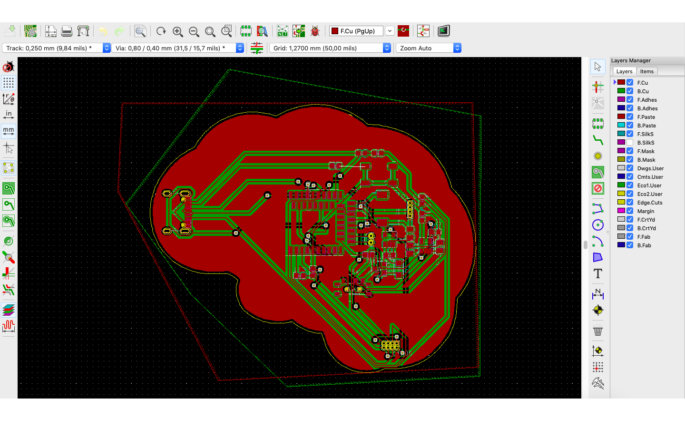
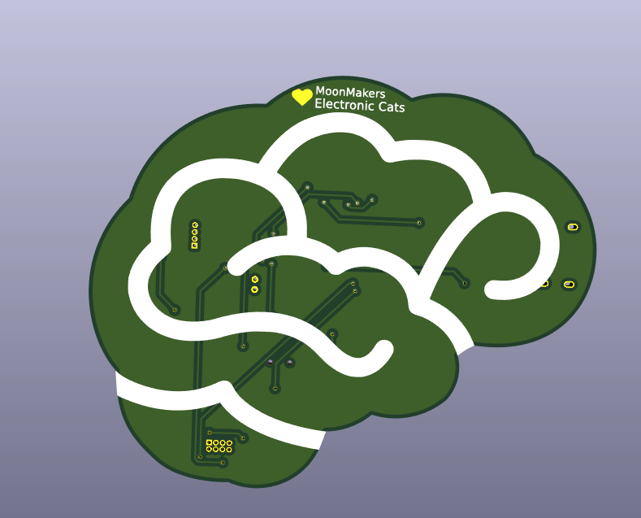
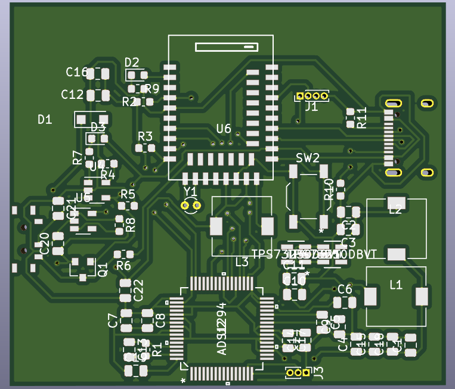

# Brain 🧠

Brain(Cerebro) es una placa de desarrollo, que cuenta con un EEG (electroencefalograma) que mediante electrodos medimos la actividad cerebral de 12 Hz - 30 Hz, que corresponde a la concentración, con el objetivo de utilizarlo como una herramienta de aprendizaje en distintas disciplinas que se puede llevar a cualquier parte para aprender mientras te diviertes.
De igual manera se está desarrollando una plataforma para facilitar el uso y el aprendizaje con Brain.

## Desarrollo de placa

Este desarollo es una colaboracion con Electronic cats ([web](https://electroniccats.com))  y MoonMakers ([web](https://moonmakers.org/)) fue creada en la plataforma de Kicad 5.1

Usamos el microcontrolador nrf52840 en la forma E73-2G4M08S1C, está construido alrededor de la CPU ARM® Cortex ™ -M4 de 32 bits, tiene soporte de protocolo para Bluetooth 5, Bluetooth mesh, Thread, Zigbee, 802.15.4, ANT y pilas propietarias de 2.4 GHz. también tienen una resolución de 12 bits en puertos analogicos.

En la parte de los filtros EEG usamos el chip ads1294, cuenta con una resolución de 24 bits por canal, y hasta con 4 canales disponibles que pueden también usarse como un ECG (electrocardiograma)

